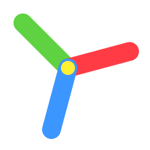

# Crayon Engine

A lightweight 2D/3D game engine with retro aesthetics, modern physics, and Lua scripting. Built with C++20, OpenGL 3.3, SDL3, and Jolt Physics.

## logo



## Features

- **Full Lua Scripting** — Complete engine API exposed to LuaJIT
- **2D & 3D Rendering** — Batched 2D sprites + 3D mesh rendering
- **Skeletal Animation** — Skinned models, layered blending, physics-pose integration
- **Virtual Resolution** — Pixel-perfect scaling with 4 modes (`integer`, `aspect`, `stretch`, `center`)
- **Retro Effects** — Jitter, affine mapping, dithering, CRT scanlines, curvature, vignette, distance fog
- **3D Lighting** — Directional light + 4 point lights + 4 spot lights
- **Shading Modes** — Gouraud, Flat, Unlit
- **3D Physics** — Jolt Physics with rigid bodies, constraints, raycasting, sensors, characters, vehicles, ragdolls, skeletons, and soft bodies
- **2D Physics** — Box2D-style rigid bodies, joints, and fixtures
- **Post-Processing** — Stackable effect chain with custom shaders and uniforms
- **Particles** — CPU particle emitters with 2D/3D rendering
- **Audio** — SFX, positional 3D audio, streamed music, per-channel volume
- **Input** — Keyboard, mouse, gamepad, text input, clipboard
- **Project System** — `.crayonproj` manifests for games and demos
- **Hot Reload** — Instant script reload on file change or F5
- **Asset Loading** — PNG/JPG textures, OBJ/GLTF/GLB models, procedural meshes
- **Cross-Platform** — Windows, Linux, macOS

## Quick Start

### Command Line

```bash
# Run a Lua script directly
crayon game/main.lua

# Run a project folder (must contain a .crayonproj manifest)
crayon path/to/my_project/

# Run a project by its manifest
crayon path/to/my_project/.crayonproj

# Run the project in the current directory (if .crayonproj exists)
crayon
```

### CLI Options

| Option | Description |
|--------|-------------|
| `--game, -g <path>` | Specify entry script path or project folder |
| `--window <W>x<H>` | Override physical window resolution (e.g. `1280x720`) |
| `--res <W>x<H>` | Override virtual canvas resolution (e.g. `320x240`) |
| `--version, -v` | Display version information |
| `--help, -h` | Display help message |

Example with overrides:

```bash
crayon my_game/ --window 1280x720 --res 320x240
```

### Project Manifest (`.crayonproj`)

A `.crayonproj` file marks a directory as a Crayon project and tells the engine which script to run.

- Passing a **folder** — the engine looks for `<folder>/.crayonproj`
- Passing a **`.crayonproj` file** — the engine uses it directly and changes the working directory to its parent
- Passing **nothing** — the engine looks for `.crayonproj` in the current directory

### Basic Game Script

```lua
function crayon.init()
    crayon.window.setResolution(320, 240)
    crayon.window.setTitle("My Game")
end

function crayon.update(dt)
    if crayon.key.isPressed("escape") then
        crayon.window.quit()
    end
end

function crayon.draw()
    crayon.graphics.clear(0.1, 0.1, 0.2)
    crayon.graphics.setColor(1, 1, 1, 1)
    crayon.graphics.drawText("Hello World!", 10, 10, 2)
end
```

> **Note:** All engine APIs use **camelCase** (e.g. `setResolution`, `drawRect`, `isPressed`). Body, model, and other object handles expose methods via `:` (e.g. `body:getPosition()`).

## Configuration

Engine startup is configured through an optional `crayon.config(t)` function that runs before `crayon.init()`.

```lua
function crayon.config(t)
    t.identity = "MyGame"
    t.version = "1.0.0"
    t.fpsLimit = 60
    t.console = false

    t.window = {
        title = "My Game",
        width = 1280, height = 720,
        virtualWidth = 320, virtualHeight = 240,
        minWidth = 640, minHeight = 360,
        resizable = true,
        fullscreen = false,
        vsync = true,
        transparent = false,
        borderless = false,
        alwaysOnTop = false,
        scaling = "integer"           -- "integer" | "aspect" | "stretch" | "center"
    }

    t.modules = {
        physics3d = true,
        physics2d = true,
        audio = true,
        mesh3D = true,
        particles = true,
        input = true,
        fs = true
    }

    t.graphics = {
        clearColor = {0.1, 0.1, 0.15, 1.0},
        dither = false,
        crt = false,
        vignette = false
    }
end
```

## Graphics API Examples

### 2D Rendering
```lua
-- Sprites
local tex = crayon.graphics.loadTexture("player.png")
crayon.graphics.drawSprite(tex, x, y, 32, 32, angle, 16, 16)

-- Shapes
crayon.graphics.setColor(1, 0, 0, 1)
crayon.graphics.drawRect("fill", 10, 10, 50, 50)
crayon.graphics.drawCircle("fill", 100, 100, 30)

-- Text
crayon.graphics.drawText("Score: " .. score, 10, 10, 2)

-- 2D Camera
crayon.graphics.setCamera2d({ x = 0, y = 0, zoom = 1.0, angle = 0 })

-- Transforms
crayon.graphics.pushMatrix2d()
crayon.graphics.translate2d(100, 100)
crayon.graphics.rotate2d(1.57)
crayon.graphics.drawSprite(tex, 0, 0, 32, 32)
crayon.graphics.popMatrix2d()
```

### 3D Rendering
```lua
-- 3D Camera
crayon.graphics.setCamera3d({
    position = {0, 3, 8},
    target   = {0, 0, 0},
    fov      = 60,
    near     = 0.1,
    far      = 1000.0
})

-- Lighting
crayon.graphics.setLight(-0.5, -1, -0.7, 1, 0.95, 0.9, 0.25, 0.25, 0.3)
crayon.graphics.setPointLight(0, 0, 5, 0, 1, 1, 1, 10, 1)
crayon.graphics.setShadingMode("gouraud")

-- 3D Objects
crayon.graphics.drawCube(x, y, z, 1, 1, 1, tex, rx, ry, rz)
crayon.graphics.drawSphere(x, y, z, 0.5, tex)
crayon.graphics.drawBillboard(x, y, z, 1, 1, tex, "cylindrical")

-- Models
local model = crayon.graphics.loadModel("cube")  -- or "sphere", "torus", or .obj/.gltf/.glb path
crayon.graphics.drawModel(model, x, y, z, rx, ry, rz, 1, 1, 1, tex)

-- 3D Transforms
crayon.graphics.pushMatrix()
crayon.graphics.translate(0, 2, 0)
crayon.graphics.rotate(t, 0, 1, 0)
crayon.graphics.scale(1.5, 1.5, 1.5)
crayon.graphics.drawSphere(0, 0, 0, 0.5)
crayon.graphics.popMatrix()

-- Lines & Debug
crayon.graphics.drawLine3d(x1, y1, z1, x2, y2, z2)
crayon.graphics.drawGrid3d(20, 20, 0)
crayon.graphics.drawAxes3d(0, 0, 0, 1)
```

### Retro Effects
```lua
crayon.graphics.setRetroEffects({
    jitterResolution = {160, 120},   -- Pixel snap resolution
    affine           = 1.0,          -- 0 = perspective, 1 = affine
    dither           = true,
    colorDepth       = 32,           -- 8 or 32
    fog = {
        startDist = 5.0,
        endDist   = 25.0,
        color     = {0.1, 0.1, 0.2}
    },
    crt = {
        scanlines = 0.25,
        curvature = 0.05,
        vignette  = 0.25
    }
})
```

### Post-Processing
```lua
crayon.graphics.pushEffect("bloom", { intensity = 1.5, threshold = 0.8 })
-- ... draw scene ...
crayon.graphics.setEffectUniform("intensity", 2.0)
crayon.graphics.popEffect()
```

### Canvas
```lua
local canvas = crayon.graphics.createCanvas(320, 240)
canvas:renderTo(function()
    canvas:clear(0, 0, 0, 1)
    crayon.graphics.setColor(1, 0.5, 0)
    crayon.graphics.drawCircle("fill", 160, 120, 50)
end)
crayon.graphics.drawSprite(canvas:getTexture(), 0, 0)
```

### Skeletal Animation
```lua
local model    = crayon.graphics.loadModel("character.glb")
local animator = model:createAnimator()
animator:play("Idle", true)

local physics_skel = model:createPhysicsSkeleton()
local pose         = crayon.physics3d.createSkeletonPose(physics_skel)

function crayon.update(dt)
    animator:update(dt)
    animator:applyToPhysicsPose(pose)
    pose:calculateMatrices()
end

function crayon.draw()
    crayon.graphics.drawModelSkinned(model, animator, 0, 0, 0, 0, 0, 0, 1, 1, 1, 0)
end
```

## Physics API Examples

### Physics3D Bodies
```lua
-- Create bodies
local box    = crayon.physics3d.createBox(0, 2, 0, 0.5, 0.5, 0.5, "dynamic", 0.5, 0.2)
local sphere = crayon.physics3d.createSphere(0, 5, 0, 0.5, "dynamic", 0.5, 0.5)
local floor  = crayon.physics3d.createPlane(0, -0.5, 0, 0, 1, 0, 50)

-- Motion types: "static", "kinematic", "dynamic"
box:setMotionType("kinematic")

-- Transforms (method calls)
local x, y, z = box:getPosition()
box:setPosition(0, 3, 0, true)
local rx, ry, rz = box:getRotation()
box:setRotation(0, 0.785, 0, true)

-- Dynamics
local vx, vy, vz = box:getVelocity()
box:setVelocity(5, 0, 0)
box:applyForce(0, -9.81, 0)
box:applyImpulse(0, 5, 0)
box:applyTorque(0, 1, 0)

-- Properties
box:setFriction(0.8)
box:setRestitution(0.3)
box:setGravityFactor(1.0)
box:setDamping(0.1, 0.1)
box:setSensor(false)
box:setMotionQuality("linearCast")  -- enable CCD

-- Lifetime
box:isValid()
box:destroy()
```

### Physics3D Constraints
```lua
-- Point constraint
local c1 = crayon.physics3d.createPointConstraint(body1, body2, px, py, pz)

-- Hinge constraint (pivot + axis)
local c2 = crayon.physics3d.createHingeConstraint(
    body1, body2,
    px, py, pz,    -- pivot
    ax, ay, az     -- axis
)

-- Distance constraint
local c3 = crayon.physics3d.createDistanceConstraint(
    body1, body2,
    p1x, p1y, p1z,
    p2x, p2y, p2z,
    min_dist, max_dist
)

-- Fixed constraint
local c4 = crayon.physics3d.createFixedConstraint(body1, body2)

-- Destroy
crayon.physics3d.destroyConstraint(c1)
```

### Physics3D Queries
```lua
-- Raycast (returns hit + hit data + body handle)
local hit, hx, hy, hz, nx, ny, nz, dist, body = crayon.physics3d.raycast(
    ox, oy, oz,    -- origin
    dx, dy, dz,    -- direction
    max_dist
)

-- Overlap sphere
local hits = crayon.physics3d.overlapSphere(cx, cy, cz, radius)
for _, body in ipairs(hits) do
    print("Body in sphere:", body:getId())
end

-- Debug visualization
crayon.physics3d.drawDebug(0.2, 1, 0.4, 1, 0.5, 0.5, 0.5, 1)
```

### Physics3D World
```lua
crayon.physics3d.setGravity(0, -9.81, 0)
crayon.physics3d.step(dt)                -- step the simulation
crayon.physics3d.getBodyCount()          -- returns total, active
crayon.physics3d.getBody(id)             -- returns body or nil
crayon.physics3d.destroyAll()            -- clears the world
```

### Physics2D Bodies
```lua
crayon.physics2d.setGravity(0, 980)
crayon.physics2d.setMeterScale(32.0)

local ground = crayon.physics2d.createBody("static", 160, 220)
ground:addBox(320, 20)

local box = crayon.physics2d.createBody("dynamic", 160, 100)
box:addBox(20, 20, 0, 0, 0, 1.0, 0.3, 0.1)

local bx, by = box:getPosition()
box:setLinearVelocity(50, 0)
box:applyImpulse(0, 200)
```

### Physics2D Joints
```lua
local j = crayon.physics2d.createRevoluteJoint(
    bodyA, bodyB,
    ax, ay,
    true, -1.57, 1.57,     -- enableLimit, lower, upper
    true, 2.0, 100.0,      -- enableMotor, speed, maxTorque
    false                  -- collideConnected
)
j:destroy()
```

## Input API Examples

Input is split into `crayon.key`, `crayon.mouse`, `crayon.gamepad`, and a unified `crayon.input` namespace.

```lua
-- Keyboard (crayon.key)
if crayon.key.isDown("w") then moveForward() end
if crayon.key.isPressed("space") then jump() end
if crayon.key.isReleased("shift") then stopSprint() end

if crayon.key.isShiftDown() and crayon.key.isPressed("s") then
    print("Shift+S pressed!")
end

-- Mouse (crayon.mouse)
local mx, my   = crayon.mouse.getPosition()
local dx, dy   = crayon.mouse.getDelta()
local wx, wy   = crayon.mouse.getWheel()
if crayon.mouse.isPressed("left") then
    print("Left click at:", mx, my)
end

-- Text input / clipboard
crayon.key.setTextInput(true)
local text = crayon.key.getTextInput()
crayon.key.setClipboard("Hello!")

-- Gamepad (crayon.gamepad)
if crayon.gamepad.isDown(0) then fire() end             -- A button
local lx = crayon.gamepad.getAxis("leftx")
local ly = crayon.gamepad.getAxis("lefty")

-- Unified aliases (crayon.input)
if crayon.input.isKeyDown("w") then moveForward() end
if crayon.input.isKeyPressed("space") then jump() end
if crayon.input.isMousePressed("left") then shoot() end
local umx, umy = crayon.input.getMousePosition()
```

## Window API Examples

```lua
-- Basic setup
crayon.window.setResolution(320, 240)
crayon.window.setWindowSize(960, 720)
crayon.window.setTitle("My Game")
crayon.window.setVsync(true)

-- Scaling modes
crayon.window.setScalingMode("integer")  -- Pixel-perfect
crayon.window.setScalingMode("aspect")   -- Letterbox
crayon.window.setScalingMode("stretch")  -- Fill screen
crayon.window.setScalingMode("center")   -- 1:1 unscaled

-- Fullscreen toggle
if crayon.key.isPressed("f11") then
    crayon.window.setFullscreen(not crayon.window.isFullscreen())
end

-- Window state
crayon.window.maximize()
crayon.window.minimize()
crayon.window.restore()
crayon.window.setPosition(100, 100)
crayon.window.center()

-- Advanced
crayon.window.setOpacity(0.9)
crayon.window.setAlwaysOnTop(true)
crayon.window.setMouseGrab(true)
crayon.window.showCursor(false)

-- Get info
local w, h   = crayon.window.getWindowSize()
local rx, ry = crayon.window.getResolution()
local fps    = crayon.window.getFps()
local dw, dh = crayon.window.getDisplaySize()
```

## Audio API Examples

```lua
-- Sound effects
local coin = crayon.audio.loadSound("coin.wav")
crayon.audio.playSound(coin, { volume = 0.8, pitch = 1.0 })

-- Positional 3D audio
crayon.audio.setListenerPosition(0, 2, 0)
crayon.audio.setListenerOrientation(0, 0, -1, 0, 1, 0)
crayon.audio.playSound3d(coin, 5, 1, 3, { volume = 1.0, minDist = 1, maxDist = 25 })

-- Music
crayon.audio.playMusic("bgm.ogg", { loop = true, fadeIn = 2.0 })
crayon.audio.setMusicVolume(0.6)
crayon.audio.stopMusic(1.0)

-- Volume control
crayon.audio.setMasterVolume(0.9)
crayon.audio.setSfxVolume(0.7)
```

## Particles API Examples

```lua
local fire = crayon.particles.createEmitter({
    maxParticles = 500,
    emissionRate = 100,
    lifetimeMin  = 0.3,
    lifetimeMax  = 0.8,
    sizeStart    = 0.6,
    sizeEnd      = 0.1,
    gravity      = -2.0,
    blendMode    = "additive",
    is3d         = true
})
fire:setPosition(0, 1, 0)

function crayon.update(dt)
    fire:update(dt)
    if crayon.key.isPressed("space") then
        fire:burst(100)
    end
end

function crayon.draw()
    fire:draw3d()
end
```

## Time API

```lua
local total = crayon.time.getTime()   -- total elapsed seconds
local dt    = crayon.time.getDt()     -- frame delta time
local fps   = crayon.time.getFps()    -- frames per second
```

## Math API

```lua
-- Scalars
crayon.math.lerp(a, b, t)
crayon.math.clamp(v, min, max)
crayon.math.smoothstep(e0, e1, x)
crayon.math.remap(v, inMin, inMax, outMin, outMax)
crayon.math.damp(a, b, lambda, dt)
crayon.math.noise(x [, y])

-- Vectors
crayon.math.vec2Normalize(x, y)
crayon.math.vec3Cross(x1,y1,z1, x2,y2,z2)
crayon.math.vec3Distance(x1,y1,z1, x2,y2,z2)

-- Quaternions
crayon.math.quatFromEuler(pitch, yaw, roll)
crayon.math.quatSlerp(q1x,q1y,q1z,q1w, q2x,q2y,q2z,q2w, t)
```

## File System API

```lua
local data = crayon.fs.readText("config.json")
crayon.fs.writeText("saves/slot1.dat", "player data")
crayon.fs.appendText("log.txt", "new line\n")

if crayon.fs.exists("mods/") then
    for _, f in ipairs(crayon.fs.listDir("mods/")) do
        print(f)
    end
end

local save_dir = crayon.fs.getSaveDir("MyStudio", "MyGame")
```

## Lua Callbacks

The runtime invokes these optional `crayon.*` functions if they are defined:

| Callback | Args |
|----------|------|
| `crayon.config(t)` | t |
| `crayon.init()` | — |
| `crayon.update(dt)` | dt |
| `crayon.draw()` | — |
| `crayon.quit()` | — |
| `crayon.keydown(key, isRepeat)` | key, is_repeat |
| `crayon.keyup(key)` | key |
| `crayon.mousedown(x, y, button)` | x, y, btn |
| `crayon.mouseup(x, y, button)` | x, y, btn |
| `crayon.mousemoved(x, y, dx, dy)` | x, y, dx, dy |
| `crayon.wheelmoved(dx, dy)` | dx, dy |
| `crayon.textinput(text)` | text |
| `crayon.gamepaddown(btn)` | btn |
| `crayon.gamepadup(btn)` | btn |
| `crayon.gamepadaxis(axis, value)` | axis, value |
| `crayon.windowResized(w, h)` | w, h |
| `crayon.focusChanged(focused)` | bool |
| `crayon.onCollisionEnter(a, b, nx, ny, nz, impulse)` | body ids + contact info |
| `crayon.onCollisionExit(a, b)` | body ids |
| `crayon.onTriggerEnter(sensor, other)` | body ids |
| `crayon.onTriggerExit(sensor, other)` | body ids |
| `crayon.collision2dEnter(a, b, nx, ny, impulse)` | body ids + contact info |
| `crayon.collision2dExit(a, b)` | body ids |
| `crayon.trigger2dEnter(sensor, other)` | body ids |
| `crayon.trigger2dExit(sensor, other)` | body ids |

## Build Requirements

| Dependency | Version | Purpose |
|------------|---------|---------|
| C++ Compiler | C++20 | Language standard |
| OpenGL | 3.3+ | Graphics rendering |
| SDL3 | Latest | Windowing & input |
| GLM | Latest | Math operations |
| GLAD | Latest | OpenGL loading |
| Jolt Physics | Latest | 3D physics |
| Box2D | Latest | 2D physics |
| LuaJIT | Latest | Scripting |
| stb_image | Latest | Texture loading |
| tinyobjloader | Latest | OBJ model loading |

## Building

```bash
# Configure
cmake -B build -DCMAKE_BUILD_TYPE=Release

# Build
cmake --build build --config Release

# Run
./build/crayon game/main.lua
```

## License

MIT License — See LICENSE file for details.